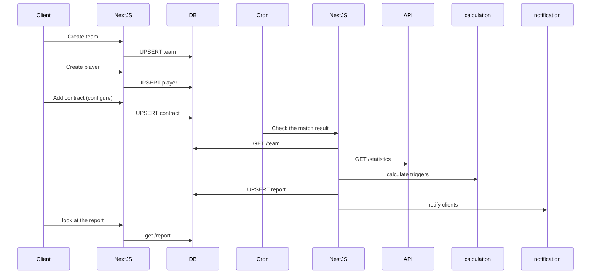

# Architecture

Sift is a Yarn workspaces monorepo with three frontend applications, one shared UI package, and one documentation package.

## Repository layout

```text
apps/
  public/   # Next.js public zone (:3000)
  admin/    # Next.js admin area (:3001)
  client/   # Next.js client area (:3002)
packages/
  ui/       # Shared Material UI components, theme, and Storybook
  docs/     # Docusaurus documentation site (:3003)
```

## Application layer

- <a href="/docs/readmes/public-app-readme">`apps/public`</a>, <a href="/docs/readmes/admin-app-readme">`apps/admin`</a>, and <a href="/docs/readmes/client-app-readme">`apps/client`</a> are Next.js apps using the App Router.
- Each app has its own runtime port and deployment boundary.
- Each app currently renders a dedicated zone homepage and consumes shared UI primitives from `@sift/ui`.

## Shared UI layer

- `packages/ui` centralizes design tokens and reusable components.
- The shared `AppThemeProvider` wraps every app layout.
- Material UI and Emotion are used for component styling and theme propagation.
- Storybook is used to develop and validate UI components independently.

## Documentation layer

- `packages/docs` is a Docusaurus site used for technical/product documentation.
- The docs site is versioned in the same repository as apps and shared UI, so architecture and delivery plans evolve with code.

## Tooling and quality gates

- Workspace management: Yarn `4.x` workspaces.
- Language/tooling: TypeScript across apps and packages.
- Tests: Vitest for frontend apps.
- Pre-commit guardrails: Husky runs workspace `typecheck` and `lint` before commit.

## Hi Level sequence diagram


